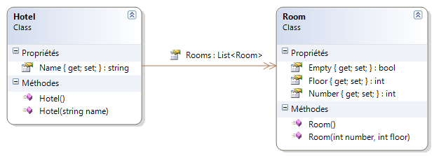
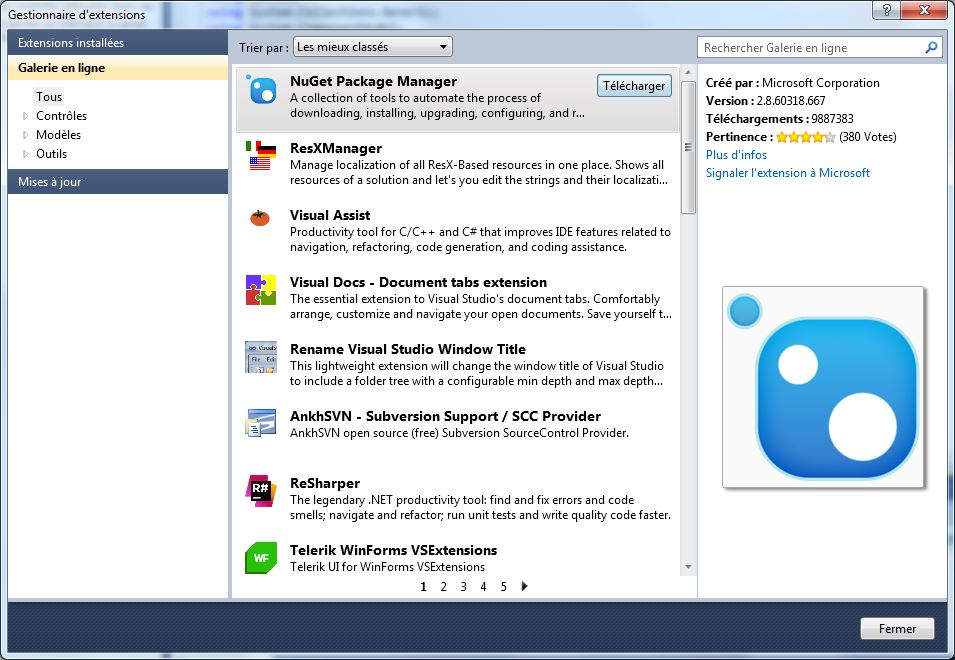

# Interactions avec les fichiers

L'objectif de ce chapitre est de présenter plusieurs techniques pour lire et écrire dans des fichiers.

## Le concept de sérialisation

La plupart des applications manipulent des données *persistantes* (qui ne disparaissent pas entre deux utilisations de l'application). Pour cela, elles doivent pouvoir sauvegarder et charger leurs données depuis un support de stockage persistant : disque dur ou SSD, clé USB, etc. Une solution simple consiste à y créer un fichier contenant les données de l'application.

On appelle **sérialisation** la transformation d'une information en mémoire sous une forme permettant son stockage persistant ou son transfert.

## Contexte d'exemple

Les données métier de note application seront des chambres d'hôtel. Elles sont modélisées sous forme de classes de la manière suivante.



Un hôtel a un nom et comporte une liste de chambres. Chaque chambre possède un numéro, un étage et l'indication de sa disponibilité. Une chambre est vide par défaut.

Voici le code de création des données de test.

```csharp
Hotel hotel = new Hotel("Chelsea Hotel");
hotel.Rooms.Add(new Room(1, 0));
hotel.Rooms.Add(new Room(2, 1));
hotel.Rooms.Add(new Room(3, 1));
hotel.Rooms[2].Empty = false;
```

## Sérialisation binaire

La sérialisation binaire consiste à transformer les données en une suite d'octets avec un encodage binaire. Le résultat peut être écrit dans un fichier ou envoyé par le réseau.

Les exemples de code ci-dessous nécessitent l'ajout des directives `using` suivantes.

```csharp
using System.IO;
using System.Runtime.Serialization.Formatters.Binary;
```

### Ecriture

Voici un exemple de sérialisation d'un objet vers un fichier binaire.

```csharp
// Sauvegarde l'objet hotel dans le fichier binaire "hotel.dat"
Stream stream = File.Open("hotel.dat", FileMode.Create);
new BinaryFormatter().Serialize(stream, hotel);
stream.Close();
```

Pour que ce code fonctionne, les classes des objets sérialisés (ici `Hotel` et `Room`) doivent indiquer leur caractère sérialisable grâce à l'annotation `[Serializable()]`.

```csharp
[Serializable()]
public class Hotel
{
    // ...
```

```csharp
[Serializable()]
public class Room
{
    // ...
```

> Par défaut, le fichier résultat se trouve dans le même répertoire que l'exécutable de l'application (`bin\Debug` sous Visual Studio).

### Lecture

Voici un exemple de désérialisation d'un fichier binaire vers un objet.

```csharp
// Charge le contenu du fichier "hotel.dat" dans l'objet hotel
Stream stream = File.Open("hotel.dat", FileMode.Open);
Hotel hotel = (Hotel) new BinaryFormatter().Deserialize(stream);
stream.Close();
```

## Sérialisation XML

La sérialisation XML consiste à transformer les données en une chaîne de caractères au format [XML](https://fr.wikipedia.org/wiki/Extensible_Markup_Language). Ce format a pour avantages d'être lisible par un humain et très interopérable. Son inconvénient majeur est sa verbosité (présence de balises ouvrantes et fermantes pour chaque attribut).

Les exemples de code ci-dessous nécessitent l'ajout des directives `using` suivantes.

```csharp
using System.IO;
using System.Xml;
using System.Xml.Serialization;
```

### Ecriture

Voici un exemple de sérialisation d'un objet vers un fichier XML.

```csharp
// Sauvegarde l'objet hotel dans le fichier "hotel.xml"
StreamWriter writer = new StreamWriter("hotel.xml");
new XmlSerializer(typeof(Hotel)).Serialize(writer, hotel);
writer.Close();
```

Pour que ce code fonctionne, les classes des objets sérialisés doivent disposer d'un constructeur sans aucun paramètre.

Le fichier résultat `hotel.xml` contient les données stockées dans les classes métier.

```xml
<?xml version="1.0" encoding="utf-8"?>
<Hotel xmlns:xsi="http://www.w3.org/2001/XMLSchema-instance" xmlns:xsd="http://www.w3.org/2001/XMLSchema">
  <Name>Chelsea Hotel</Name>
  <Rooms>
    <Room>
      <Number>1</Number>
      <Floor>0</Floor>
      <Empty>true</Empty>
    </Room>
    <Room>
      <Number>2</Number>
      <Floor>1</Floor>
      <Empty>true</Empty>
    </Room>
    <Room>
      <Number>3</Number>
      <Floor>1</Floor>
      <Empty>false</Empty>
    </Room>
  </Rooms>
</Hotel>
```

> Par défaut, le fichier résultat se trouve dans le même répertoire que l'exécutable de l'application (`bin\Debug` sous Visual Studio).

### Lecture

Voici un exemple de désérialisation d'un fichier XML vers un objet.

```csharp
// Charge le contenu du fichier "hotel.xml" dans l'objet hotel
StreamReader reader = new StreamReader("hotel.xml");
Hotel hotel = (Hotel) new XmlSerializer(typeof(Hotel)).Deserialize(reader);
reader.Close();
```

> Vous trouverez plus de détails sur la sérialisation avec le framework .NET à [cette adresse](https://msdn.microsoft.com/fr-fr/library/ms233843.aspx) et sur la sérialisation XML à [cette adresse](http://tlevesque.developpez.com/dotnet/xml-serialization/).

## Sérialisation JSON

La sérialisation JSON consiste à transformer les données en une chaîne de caractères au format [JSON](https://fr.wikipedia.org/wiki/JavaScript_Object_Notation). Ce format basé sur la notation des objets en JavaScript a les mêmes avantages qu'XML tout en étant moins verbeux. Il est notamment très utilisé pour créer des API web.

### Utilisation d'une librairie externe

Le framework .NET actuel (4.6) ne supporte pas nativement la sérialisation JSON. Pour la mettre en oeuvre, il faut utiliser une librairie externe. La plus connue est [Json.NET](http://www.newtonsoft.com/json).

Pour installer cette librairie, nous allons utiliser le gestionnaire de package [NuGet](https://www.nuget.org/). Il s'agit d'une immense collection de librairies répondant à des besoins très variés et la plupart du temps *open source*. En intégrant ces librairies, on gagne du temps tout en évitant de réinventer la roue.

> NuGet est maintenant intégré en standard dans Visual Studio depuis la version 2013.

L'installation de NuGet se fait via le menu **Outils/Gestionnaire d'extensions** de Visual Studio.



Une fois NuGet installé, on peut parcourir son contenu (menu **Outils/Gestionnaire de package NuGet**) pour trouver Json.NET, puis l'ajouter à notre projet.


Les exemples de code ci-dessous nécessitent l'ajout des directives `using` suivantes.

```csharp
using System.IO;
using Newtonsoft.Json;
```

### Ecriture

Voici un exemple de sérialisation d'un objet vers un fichier JSON.

```csharp
// Sauvegarde l'objet hotel dans le fichier "hotel.json"
StreamWriter writer = new StreamWriter("hotel.json");
new JsonSerializer().Serialize(writer, hotel);
writer.Close();
```

Le fichier résultat `hotel.json` contient les données stockées dans les classes métier.

```json
{
    "Name": "Chelsea Hotel",
    "Rooms": [
        {
            "Number": 1,
            "Floor": 0,
            "Empty": true
        },
        {
            "Number": 2,
            "Floor": 1,
            "Empty": true
        },
        {
            "Number": 3,
            "Floor": 1,
            "Empty": false
        }
    ]
}
```

> Par défaut, le fichier résultat se trouve dans le même répertoire que l'exécutable de l'application (`bin\Debug` sous Visual Studio).

### Lecture

Voici un exemple de désérialisation d'un fichier JSON vers un objet.

```csharp
// Charge le contenu du fichier "hotel.json" dans l'objet hotel
StreamReader reader = new StreamReader("hotel.json");
Hotel hotel = (Hotel) new JsonSerializer().Deserialize(reader, typeof(Hotel));
reader.Close();
```
